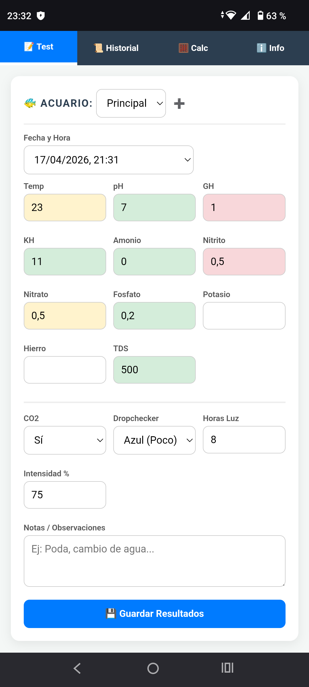
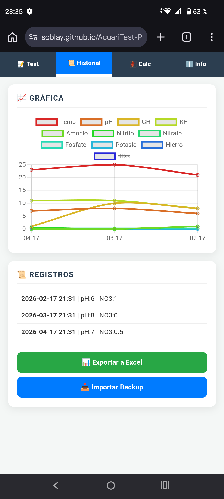
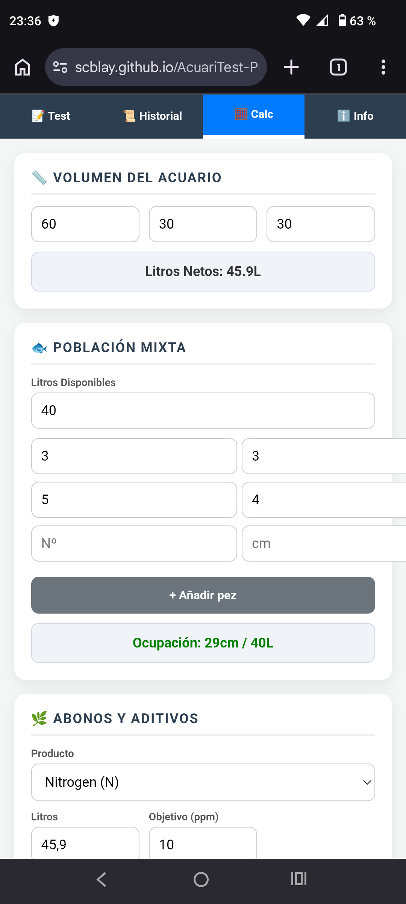
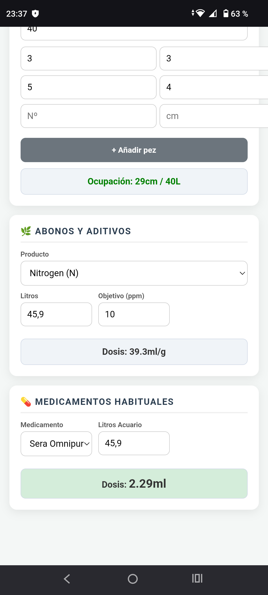
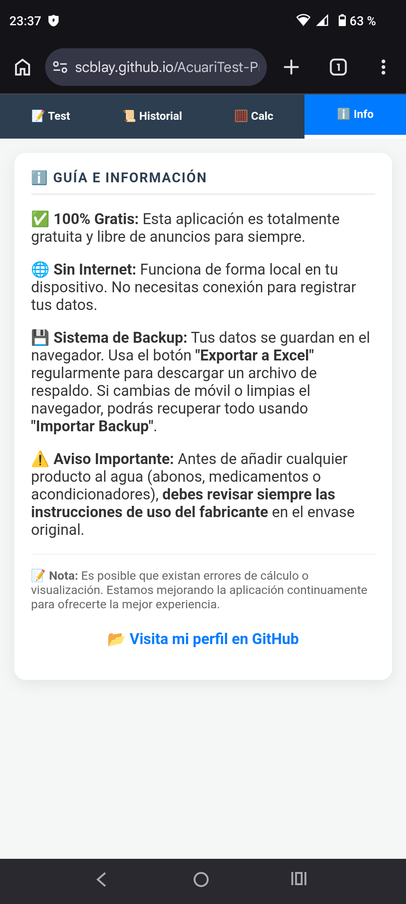

# 🐠 AcuariTest Pro

**AcuariTest Pro** es una herramienta integral, gratuita y de código abierto diseñada para acuaristas que buscan un control total sobre la salud de sus acuarios. Especialmente optimizada para el mantenimiento de Guppys, pero adaptable a cualquier ecosistema de agua dulce.

🚀 **[ACCEDER A LA APLICACIÓN]((https://scblay.github.io/AcuariTest-Pro/))**

---

## 📸 Vista previa
<table>
  <tr>
    <td></td>
    <td></td>
  </tr>
  <tr>
    <td></td>
    <td></td>
    <td></td>
  </tr>
</table>

---

## ✨ Características Principales

* 📝 **Registro de Parámetros:** Control de pH, GH, KH, Nitratos, Nitritos, Temperatura y más.
* 🚦 **Sistema de Semáforo Inteligente:** Alertas visuales (Verde, Naranja, Rojo) según los niveles ideales para la fauna.
* 🧮 **Calculadoras Avanzadas:**
    * **Medicamentos:** Dosis exactas para productos comunes (Sera Omnipur A, Baktopur, etc.) con aviso de seguridad por sobredosis.
    * **Abonos y Aditivos:** Cálculo de dosificación para la línea Seachem (incluyendo Neutral Regulator y Reef Builder) y otras marcas.
    * **Volumen Real:** Calcula los litros netos de tu acuario.
    * **Población:** Calculadora de capacidad de peces en cm/litro.
* 📈 **Historial y Gráficas:** Visualiza la evolución de tus parámetros a lo largo del tiempo.
* 🌐 **100% Offline & Privado:** Tus datos se guardan en tu navegador, sin necesidad de servidores externos ni internet.
* 📊 **Backup en Excel:** Exporta e importa tus datos fácilmente para no perder nunca tu historial.

---

## 🛠️ Instalación y Uso

No requiere instalación. Puedes usarla directamente desde el navegador de tu móvil o PC.

1. Entra en el enlace de la aplicación.
2. Añade la página a tu **"Pantalla de inicio"** en el móvil para usarla como una App nativa.
3. ¡Empieza a registrar tus tests!

---

## ⚠️ Aviso de Responsabilidad (Disclaimer)

Esta herramienta es una ayuda para el cálculo y registro. **Antes de añadir cualquier producto al agua, consulta siempre las instrucciones del fabricante en el envase.** El autor no se hace responsable del uso inadecuado de los químicos o de posibles errores en los cálculos.

---

## 🤝 Contribuciones y Soporte

Si encuentras algún error o tienes sugerencias para mejorar las calculadoras, no dudes en abrir un *Issue* en este repositorio.

Desarrollado con ❤️ para la comunidad de acuaristas por [SCBlay](https://github.com/SCBlay).

---

## 📜 Licencia

Este proyecto está bajo la **Licencia MIT**. Siéntete libre de usarlo, modificarlo y compartirlo.
